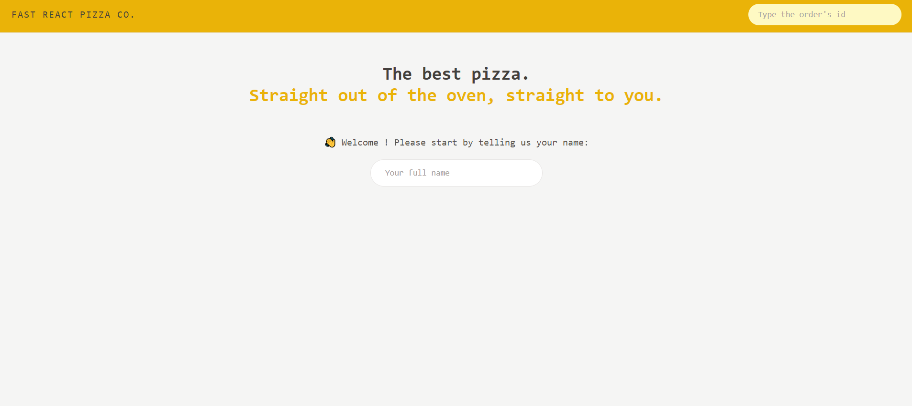
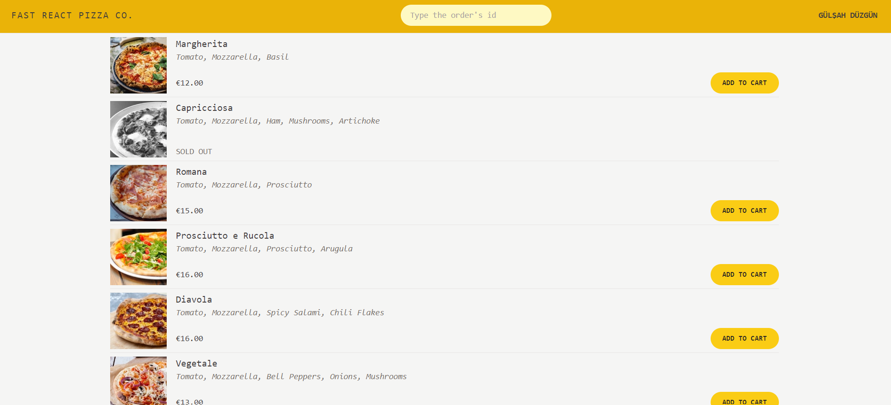
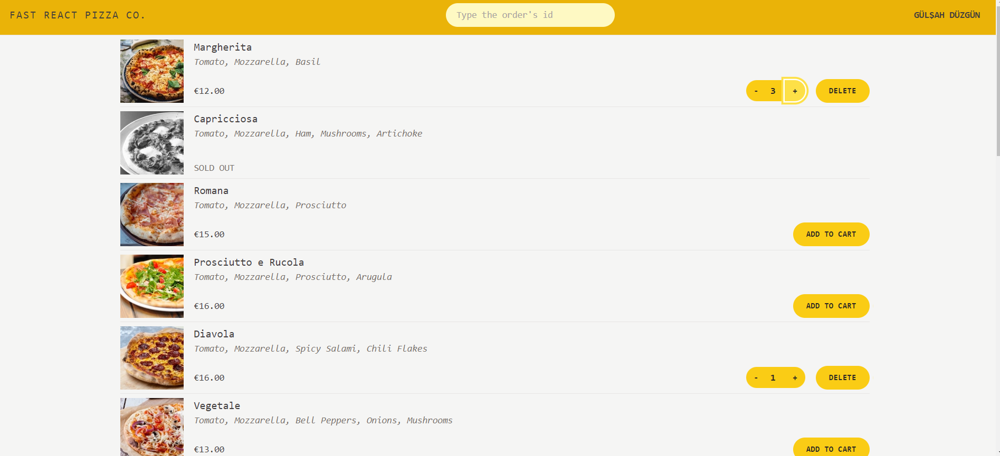
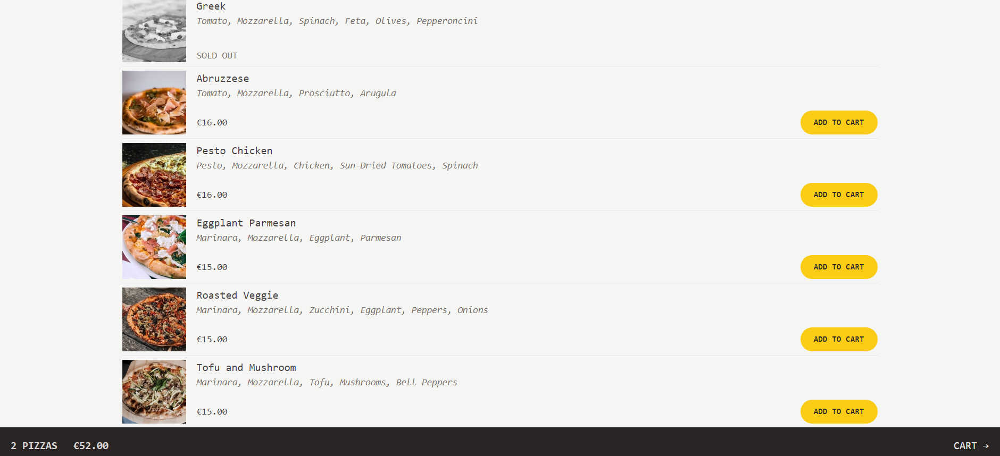
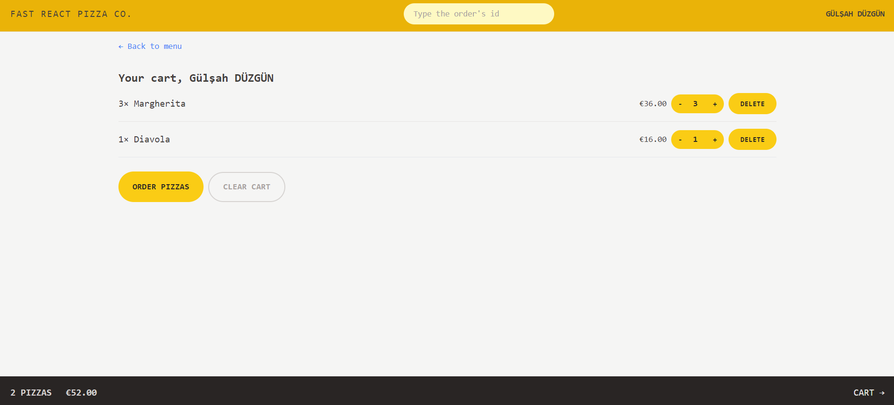
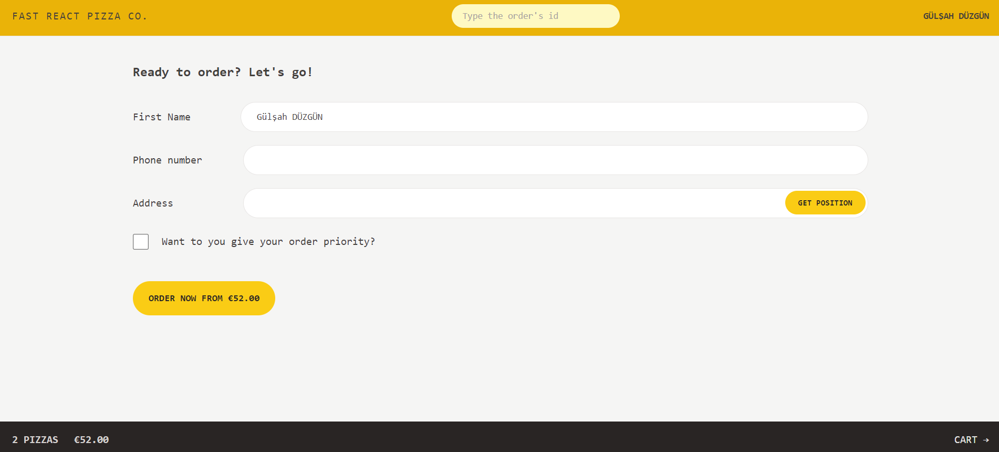
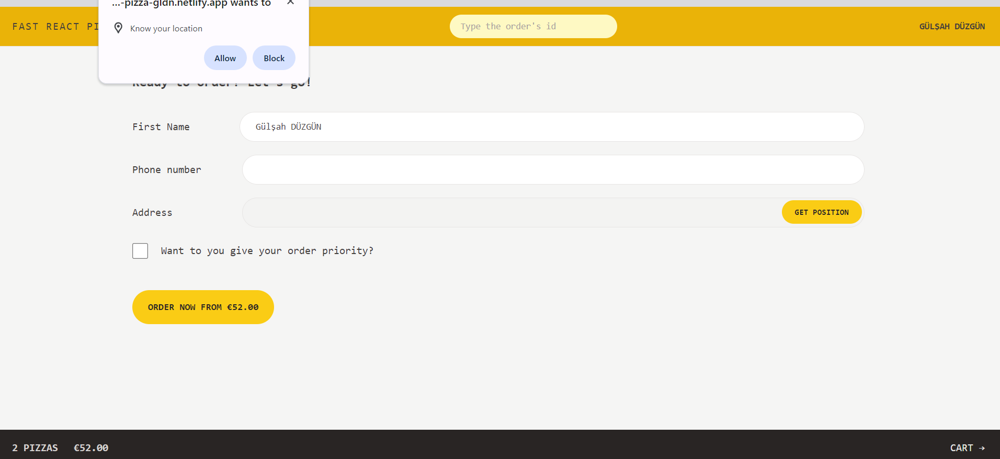
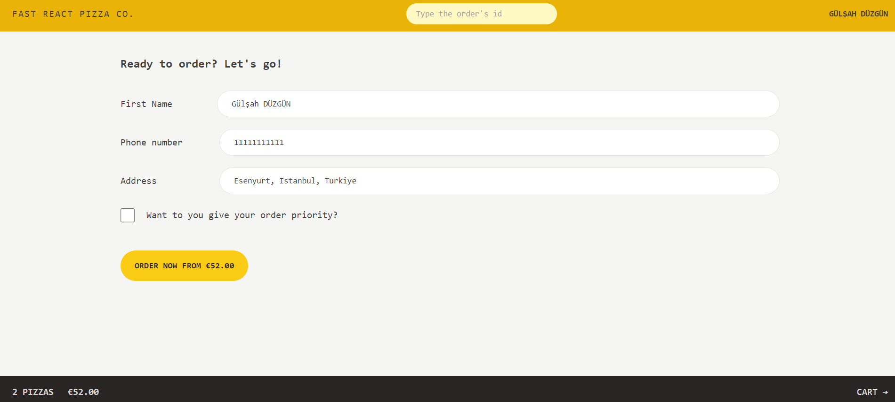
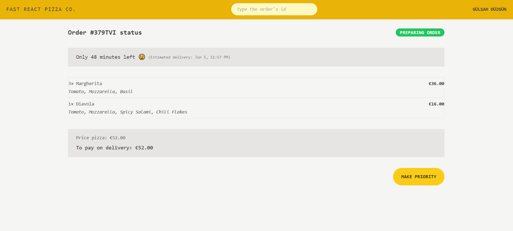
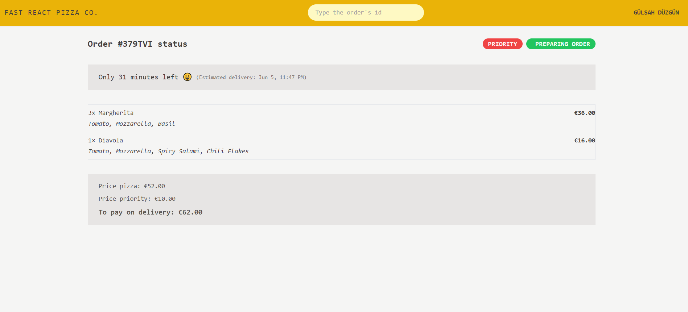

## Fast React Pizza

Fast React Pizza is a website project which I used React.js and Tailwind CSS. You can start visiting by typing your name and then press enter. After the menu page is opened, you can add pizzas that you want your card but you can't add already sold out pizzas 🍕. You can check your shopping cart at the bottom of the page. On this page you can change the quantity of pizzas, clear the cart by clicking Clear Cart button. If you click the Order Pizzas button, you will redirect to user info page. After you type phone number and address input field, you can give your order. You can automatically take your address from Geolocation API by clicking get position button and allow to access your location. Also you could give priority your order for being prepared quickly. Giving priority is cost of 20% of total cost. You can check the ingredients of the ordered pizzas and you can check the order's status by searching with the id 🔎.

You can try by clicking <strong>[ Fast React Pizza ](https://fast-react-pizza-gldn.netlify.app/)</strong>.

## Technologies Used

- HTML
- Tailwind CSS
- React.js, Redux, React Router, Redux Toolkit, Redux Thunks (useState, useEffect, useReducer, useDispatch, useNavigate, useLoaderData, useRouteError, useFetcher, useSelector, createSlice createAsyncThunk)

 

   
   
 
   
   
 
   
   
 
   
   
 
   
   
 
   
   
 
   
   
 
   
   
 
   
   
 
   
   
 
